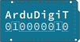

# ArduDigiT

Dieses Repository enthält alle Dateien, die im Zusammenhang mit dem ArduDigiT-Kurs stehen. Die Datei `moodlekurs.mbz` enthält außerdem eine Backupdatei, mit der der Kurs auf beliebige Instanzen dupliziert werden kann.

## Lizenzen

Die Abbildungen elektronischer Bauteile stammen von [Fritzing](https://github.com/fritzing/fritzing-parts) und stehen dort unter einer [CC BY-SA 3.0](http://creativecommons.org/licenses/by-sa/3.0/)-Lizenz, sind teilweise durch mich verändert worden und stehen unter einer [CC BY-SA 4.0](http://creativecommons.org/licenses/by-sa/4.0/?ref=chooser-v1)-Lizenz.

Alle anderen Materialien sind entweder durch mich erstellt oder lizenzfrei von Dritten und stehen nun ebenfalls unter einer [CC BY-SA 4.0](http://creativecommons.org/licenses/by-sa/4.0/?ref=chooser-v1)-Lizenz.
